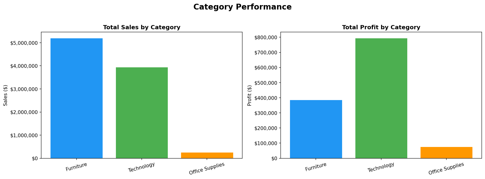
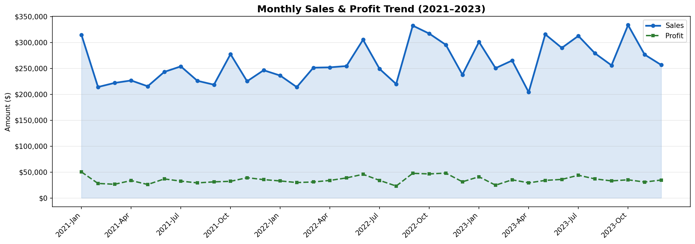
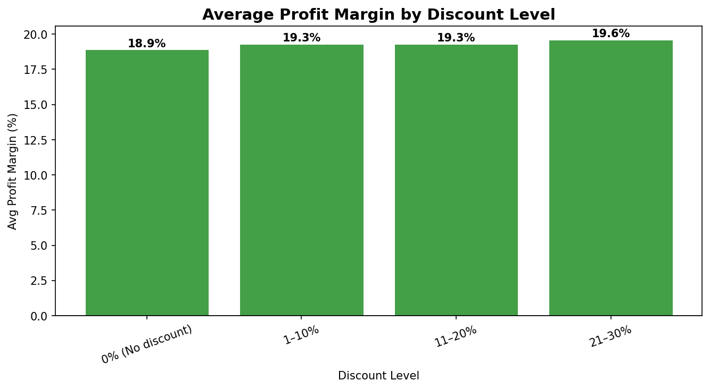
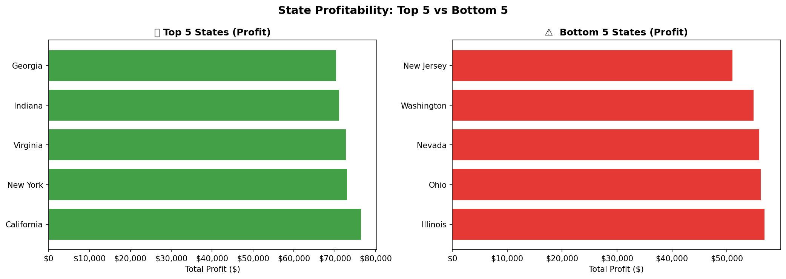

# Superstore Sales Analysis
*Portfolio Project 1: Data Analyst Track*

# Project Overview
An end-to-end exploratory data analysis of a retail superstore's sales data (2021–2023).
The goal was to identify key drivers of revenue and profit, uncover underperforming segments,
and produce actionable business recommendations.

**Role simulated:** Junior Data Analyst reporting to a Sales Director.

---

# Business Questions Answered
1. Which product category drives the most revenue? Which is most *profitable*?
2. Which region is our strongest performer? Which needs attention?
3. How have sales trended month-over-month across 3 years?
4. Do discounts drive sales — or silently destroy our margins?
5. Which states are our best and worst markets?

---

# Charts









> Analyst recommendation: Cap discounts at 20%. Investigate furniture cost structure.

---

## Tools & Skills Used
- Python (Pandas, Matplotlib, Seaborn)
- Data Cleaning — date parsing, type conversion, duplicate detection
- Exploratory Data Analysis (EDA) — groupby, aggregation, time series
- Data Visualisation — 5 publication-quality charts
- Business Storytelling — translating data into decisions

---

# Project Structure
```
project1_superstore/
├── data/
│   └── generate_dataset.py   # Script to generate the dataset
├── analysis.py               # Main analysis script
├── superstore_sales.csv      # Dataset (5,000 rows, 14 columns)
└── output/                   # Generated charts
    ├── 01_category_performance.png
    ├── 02_regional_sales.png
    ├── 03_sales_trend.png
    ├── 04_discount_analysis.png
    └── 05_state_performance.png
```

# How to Run
```bash
pip install pandas matplotlib seaborn
python analysis.py
```

## What I Learned
- How to load, inspect, and clean CSV data with Pandas
- Using groupby() and .agg() to build summary tables
- Parsing dates and extracting time features for trend analysis
- Building multi-panel Matplotlib figures
- Framing data findings as business recommendations

*Part of my 12-month Data Analyst portfolio. Built from scratch as a beginner.*
